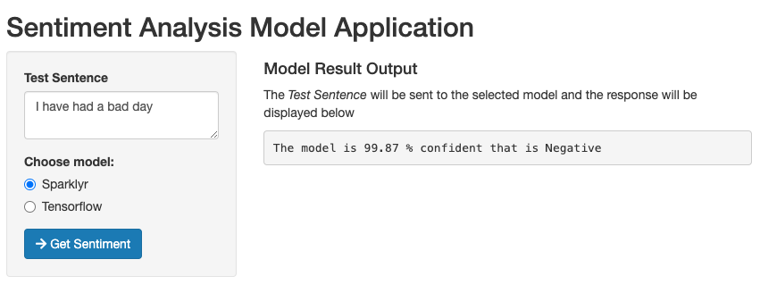
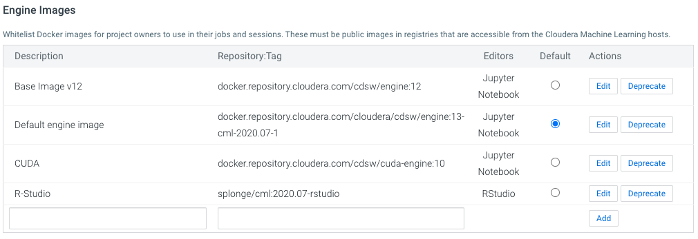
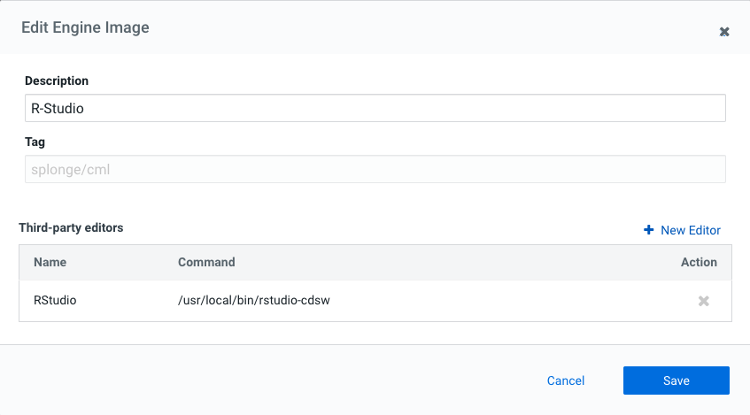
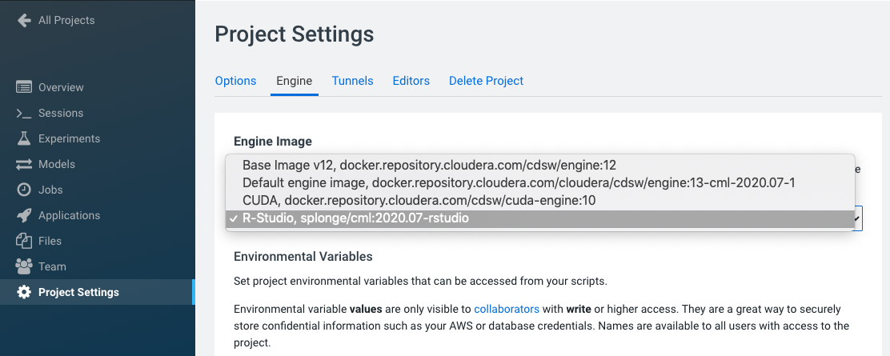
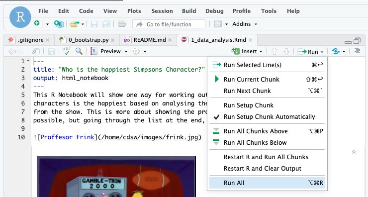
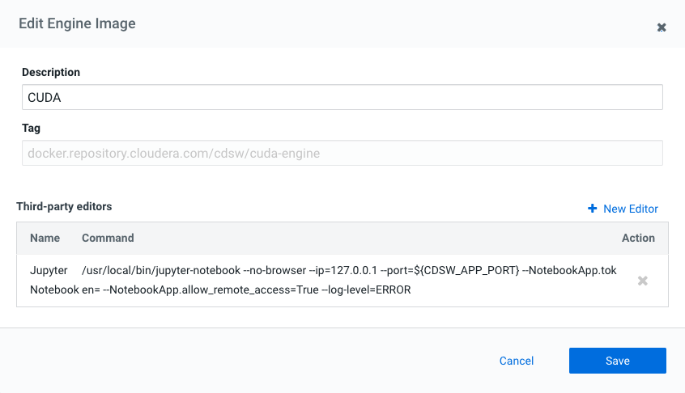
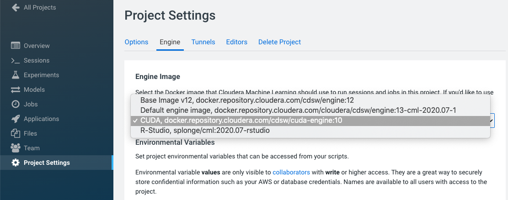
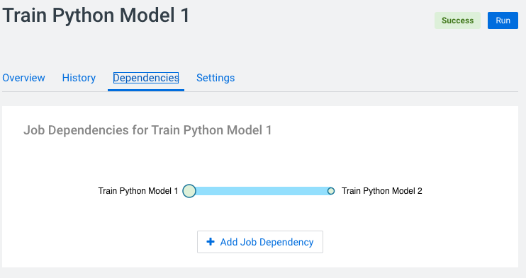
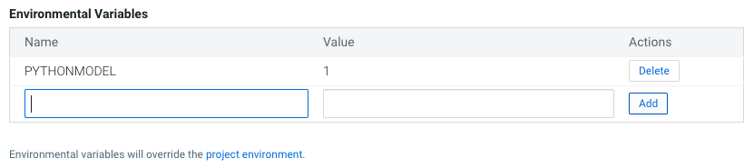

# Sentiment Analysis Prototype
This project is a Cloudera Machine Learning 
([CML](https://www.cloudera.com/products/machine-learning.html)) **Applied Machine Learning 
Project Prototype**. It has all the code and data needed to deploy an end-to-end machine 
learning project in a running CML instance.


Images Source: https://toddwschneider.com/posts/the-simpsons-by-the-data/

## Project Overview
This project builds two different Sentiment Analysis models. One model is based on text from 
the Simpsons TV show available on Kaggle [here](https://www.kaggle.com/pierremegret/dialogue-lines-of-the-simpsons) 
and uses **R code** (specifically [Sparklyr](https://spark.rstudio.com/)) to train the model. 
The other model is based on the Sentiment 140 dataset, also available on kaggle 
[here](https://www.kaggle.com/kazanova/sentiment140) and uses **Python Code** (specifically
[Tensorflow](https://tensorflow.org) with GPU). The end result is an application that will 
send a test sentence to either of the deployed models and show the predicted sentiment result.



The goal is to build a senitment classifier model using various techniques to predict the 
senitment of a new sentence, in real time.

By following the notebooks and scripts in this project, you will understand how to perform similar 
sentiment analysis tasks on CML as well as how to use the platform's major features to your 
advantage. These features include **working in different programing langues**, 
**using different engines**, **point-and-click model deployment**, and **ML app hosting**.

We will focus our attention on working within CML, using all it has to offer, while glossing over 
the details that are simply standard data science. We trust that you are familiar with typical
data science workflows and do not need detailed explanations of the code. Notes that are 
*specific to CML* will be emphasized in **block quotes**.

## *For both the R code and Python code models:*
### Initialize the Project
There are a couple of steps needed at the start to configure the Project and Workspace 
settings so each step will run sucessfully. You **must** run the project bootstrap 
before running the other steps.

#### **Project bootstrap**
Open the file `0_bootstrap.py` in a normal workbench `python3` session. You need a larger
instance of this to install `tensorflow`, at least a 1 vCPU / 8 GiB instance. 

Once the session is loaded, click **Run > Run All Lines** (or the ► button).
This will file will create an **Environment Variable** for the project called **STORAGE**, 
which is the root of default file storage location for the Hive Metastore in the 
DataLake (e.g. `s3a://my-default-bucket`). It will also upload the data used in the 
project to `$STORAGE/datalake/data/sentiment/`. 

The original data files for R code comes as part of this git repo in the `data` folder. The
**R code** will create the hive tables needed for to build the model in later steps. 
For the Python code the data and model files are too big for a github project and will be
downloaded and created as part of the setup process. 

## Project Build
To build out the complete project, you need to go through each of the steps manually to build 
and understand how the project works. There is more detail and explanation and comments in each 
of the files and notebooks so its worth looking through those. Follow the steps below and you 
will end up with a running application.

## *For the R code models:*
This is the code that will build and deploy a Sentiment Prediction model using the data from the 
Simpsons TV show. 

### **Engine Setup**
For those who are more comfortable running R-Studio as the text editor, or if you want to see
how the R notebook file renders, you need to setup R-Studio as a 
[web based editor](https://docs.cloudera.com/machine-learning/cloud/projects/topics/ml-editors-browser-engine.html). 
The process fairly straight forward, and for you now you can use an engine that has been uploaded
to dockerhub to make this easier: `splonge/cml:2020.07-rstudio`. 
You can also follow the documented process and upload the resulting engine image to any 
accessable docker repo. To add the engine, you will need admin access to CML. In the 
**Admin > Engines** section, add a new engine as the per the image below:



The next step after adding the engine is to configure R-Studio as an editor.
In the **Admin > Engines** section, click **Edit** on the newly added enging and add in the command to launch R-Studio `/usr/local/bin/rstudio-cdsw`



### 1 Data Analysis (R Code)
This file is an R notebook file that creates the datasets and hive tables required to train 
the model in the next step. This is all done using Sparklyr. It also shows the process 
of obtaining the sentiment labels for each sentence spoken by a Simpons character. There is a 
lot of detail explanation in this notebook so it is worth taking the time to go through the
detail. 

To run this file, you need to open in an R-Studio session. In the
**Project Settings** section, change the project engine to the R-Studio engine created in 
the previous step.



Then launch a new R-Studio session with the R-Studio engine: `1 vCPU, 4 GiB`. Then open the file 
`R Code/1_data_analysis.Rmd`. In the file editor in R-Studio, click on **Run > Run All** and the 
notebook code will execute and create the tables needed in the next step. 




### 2 Model Training (R Code)
There is no pre-trained model provided for the R Code therefore you will need to run this and the
previous step to deploy the model. 

> _Note:_ This is a spark based Logistic Regression model and the approach here is to train 
> the model using sparklyr and to deploy the model using pyspark. 

To train the model, open the `R Code/2_Sentiment_Model.R` file in a workbench session: 
`R, 1 vCPU, 4 GiB` and run the file. This will create 2 models, a word2vec transformer and a
logistic regression classifier and write both models to `$STORAGE/datalake/data/sentiment/` 
directory. 

The other ways of running the model training process is by running a job. 

***Jobs***

The **[Jobs](https://docs.cloudera.com/machine-learning/cloud/jobs-pipelines/topics/ml-creating-a-job.html)**
feature allows for adhoc, recurring and depend jobs to run specific scripts. To run this model 
training process as a job, create a new job by going to the Project window and clicking **Jobs >
New Job** and entering the following settings:
* **Name** : Train R Model
* **Script** : R Code/2_Sentiment_Model.R
* **Arguments** : _Leave blank_
* **Kernel** : R
* **Schedule** : Manual
* **Engine Profile** : 1 vCPU / 4 GiB
The rest can be left as is. Once the job has been created, click **Run** to start a manual 
run for that job.

### 3 Model Serving (R Code)
The **[Models](https://docs.cloudera.com/machine-learning/cloud/models/topics/ml-creating-and-deploying-a-model.html)** 
is used top deploy a machine learning model into production for real-time prediction. To 
deploy the model trailed in the previous step, from the Project page, click **Models > New
Model** and create a new model with the following details:

* **Name**: r_model
* **Description**: R model
* **Enable Authentication**: [ ] _unchecked_
* **File**: R Code/3_Sentiment_Model_Predictor.py
* **Function**: predict_sentiment
* **Input**: 
```
{
	"sentence":"I'm no dunce, I was born an oaf and I'll die an oaf"
}
```
* **Kernel**: R
* **Engine Profile**: 1vCPU / 4 GiB Memory

Leave the rest unchanged. Click **Deploy Model** and the model will go through the build 
process and deploy a REST endpoint. Once the model is deployed, you can test it's working 
from the model Model Overview page. 

## *For the Python code models:*
This is the code that will build and deploy and Tensorflow based model using the Sentiment140
training dataset. 

### **Engine Setup**
If you have them available and wish to use GPUs to speed up the model training, you need to 
use and engine that has the the CUDA drivers and libraries preinstalled. 
You can [create your own GPU engine image](https://docs.cloudera.com/documentation/data-science-workbench/latest/topics/cdsw_gpu.html#custom_cuda_engine) or you now you can use CUDA technical preview engine
from Cloudera to make this easier: 

`docker.repository.cloudera.com/cdsw/cuda-engine:10`. 

See [here](https://docs.cloudera.com/documentation/data-science-workbench/latest/topics/cdsw_cuda_gpu_engine.html) for more details. 

To add the engine, you will need admin access to CML. In the 
**Admin > Engines** section, add a new engine as the per the image below:


The next step after adding the engine is to configure Jupyter Notebook back as an editor.
In the **Admin > Engines** section, click **Edit** on the newly added enging and add in 
the command to launch Jupyter Notebook:

 `/usr/local/bin/jupyter-notebook --no-browser --ip=127.0.0.1 --port=${CDSW_APP_PORT} --NotebookApp.token= --NotebookApp.allow_remote_access=True --log-level=ERROR`



### 1 Read Data (Python Code)
This is a Python file that will download and clean the data for the Sentiment Analysis model. The file does the following:

* Download Sentiment140 training data from the Stanford url
* Extract the data files
* Remove the LATIN1 encoding, and ensure only the UTF-8 encoded data is being used. This is done to avoid problems while using a Python CSV Reader.

Open the `Python Code/1_read_data.py` file in a workbench session: `Python 3, 1 vCPU, 4GiB` and
click **Run > Run All Lines** (or the ► button).

### 2 Data Pre-processing and Model Training(Python Code)
This Python file `2_pre-processing_and_model_training.py` performs the text pre-processing i.e. Tokenization, Padding, Embedding of the data, and the model building and training. Once the Tokenization is done, it is saved under the `models` folder as `sentiment140_tokenizer.pickle`, to use later, during Transfer Learning. Also, the model, after being trained, is saved on the same path as `model_conv1D_LSTM_with_batch_100_epochs.h5`.

If you want to use GPU to make this process run faster, you need to use the CUDA engine. In the
**Project Settings** section, change the project engine to the CUDA engine created in 
a previous step.



> _Note:_ its possible to switch engines during projects so you can use both the R-Studio engine
> and the CUDA engine for the different session requirements. 

The other way to train the model is to run these last to steps as a sequence of dependent jobs. 
First create a job to fetch and read the data

* **Name** : Train Python Model 1
* **Script** : Python Code/1_read_data.py
* **Arguments** : _Leave blank_
* **Kernel** : Python 3
* **Schedule** : Manual
* **Engine Profile** : 1 vCPU / 4 GiB
* **GPUs** : 0 GPUs

The rest can be left as is. Then create a second job to train the model:

* **Name** : Train Python Model 2
* **Script** : Python Code/2_pre-processing_and_model_training.py
* **Arguments** : _Leave blank_
* **Kernel** : Python 3
* **Schedule** : Dependent > Train Python Model 1
* **Engine Profile** : 2 vCPU / 8 GiB
* **GPUs** : 1 GPUs

> _Note:_ you have to set the project engine to the CUDA engine for this job to use GPU acceleration.

Once the job has been created, click **Run** on the `Train Python Model 1` job to start a manual 
run for that job. Once the first job complete, its will automatically start the second job.



### 3 Notebook on Data Pre-processing and Model Training (Python Code)
The Jupyter Notebook file `3_model_training_on_sentiment140_notebook.ipynb` shows a step-by-step process to build a sentiment analysis model from scratch. It is essentially a combination of `1_read_data.py` and `2_pre-processing_and_model_training.py` with a more detailed description of each step. Additionally, the Notebook also demonstrates some example sentences, and how the model classifies them.

To launch the notebook, you need to use the CUDA engine discussed earlier. Then launch a new Jupyter Notebook session with the CUDA engine: `2 vCPU, 8 GiB, 1 GPU`. Then open the file 
`Python Code/3_model_training_on_sentiment140_notebook.ipynb`. From you can run through the
notebook.

### 4 Model Deployment (Python Code)
The `4_model_deployment.py` is a Python script used for deploying the model and making test predictions (classification, in this case). It contains a function called `predict_sentiment` which does the following:

* Load the previously saved Tokenizer and tokenize the Input sentence using that
* Load the previously trained model
* Classify the input sentence as Positive or Negative statetment. The input sentence is passed as an argument to the function.

From the Project page, click **Models > New Model** and create a new model with the 
following details:

* **Name**: python_model
* **Description**: Python model
* **Enable Authentication**: [ ] _unchecked_
* **File**: Python Code/4_model_deployment.py
* **Function**: predict_sentiment
* **Input**: 
```
{
  "sentence": "Ive had a long day"
}
```
* **Kernel**: Python 3
* **Engine Profile**: 1vCPU / 4 GiB Memory
* **GPUs**: 0 GPUs
> _Note:_ For this model there is no speed up to be had using a GPU for model scoring, so
> you don't need to hold resources unnecessarily.

> ### _**Note:**_ **This next step is important!!**
> **Before** you deploy the model, you must add in an **Environment Variable** `PYTHONMODEL` with 
> a value of `1`. 
> 
> 
>
> Model deployment runs through a 
> [build process](https://docs.cloudera.com/machine-learning/cloud/engines-overview/topics/ml-engines-models-experiments.html) 
> that includes executing the `cdsw-build.sh` script. As this project deploys two very different
> code requirements for the models, the single build-script needs to know which libraries and
> requiresments to install. This is done by checking for the `PYTHONMODEL` 
> **Environment Variable** and then executing that section of the script.
> ```
> if [ -z "$PYTHONMODEL" ]
> then
>    echo "R Model"
>    Rscript "/home/cdsw/R Code/0_install.R"
> else
>     echo "Installing Python Requirements"
>     pip3 install --progress-bar off tensorflow==2.2.0
> ```

Leave the rest unchanged. Click **Deploy Model** and the model will go through the build 
process and deploy a REST endpoint. Once the model is deployed, you can test it's working 
from the model Model Overview page. 

## *For both the R code and Python code models:*

### 5 Deploy Application
The next step is to deploy a [Shiny](https://shiny.rstudio.com/) application using the CML 
**[Applications](https://docs.cloudera.com/machine-learning/cloud/applications/topics/ml-applications.html)** 
feature. For this project it is used to deploy a web based application that interacts with 
the underlying models created in the previous step.

> ### _**Note:**_ **This next step is important**
> For both models you need to get the **Access Key** , go to **Model > Settings** and make a 
> note (i.e. copy) the "Access Key". It will look something like this (ie. 
> mukd9sit7tacnfq2phhn3whc4unq1f38)
>
> From the Project level click on "Open Workbench" (note you don't actually have to Launch a 
> session) in order to edit a file. Select the `R Code\4_shiny_app.R` file and paste the Access 
> Keys in to the `fetch_result` function. The first Access Key is for the R Model and the second
> is for the Python model. 
> 
> ```
> fetch_result <- function (sentence, model) {
>   if (model == "simp") {
>     accessKey <-  "mfd0yk8o4tfi13uua8hc9gzqxej0jc2s"
>   }
>   else {
>     accessKey <-  "m7zzyhlbtr3ovq3tvaa2myowglhzpf3f"
>   }
> ```
> Save the file (if it has not auto saved already) and go back to the Project.

From there Go to the **Applications** section and select "New Application" with the following:
* **Name**:Sentiment Predictor
* **Subdomain**: sentibot _(note: this needs to be unique, so if you've done this before, 
pick a more random subdomain name)_
* **Script**: R Code/4_shiny_app.R
* **Kernel**: R
* **Engine Profile**: 1vCPU / 2 GiB Memory

After the Application deploys, click on the blue-arrow next to the name to launch the 
application. This application is self explanatory, type in a sentence and choose which model
to send it to to get a sentiment prediction back.


  